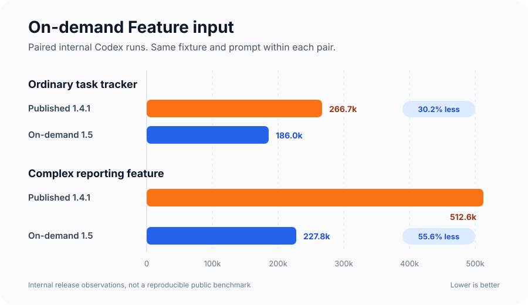
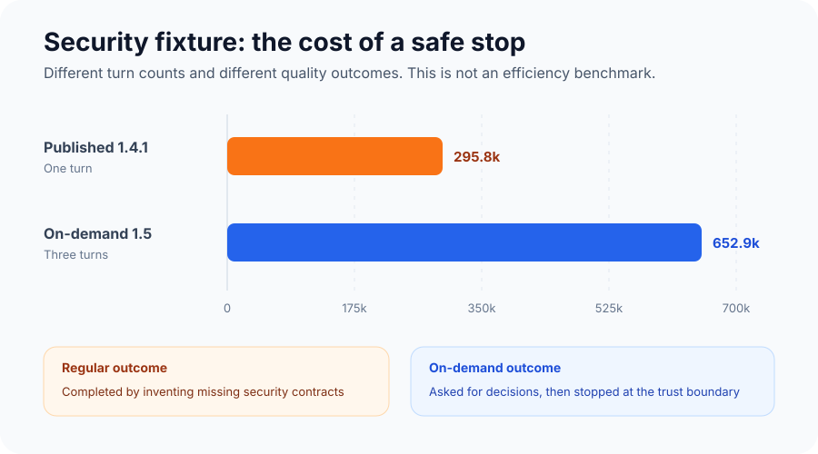

# AI Blueprint 1.5 Feature Context Optimization

AI Blueprint 1.5 changes how `/feature` gathers and uses project context. The
goal was to reduce repeated input without producing weaker specifications or
letting the workflow guess material product and security decisions.

In two paired internal tests, Feature input fell by 30.2% on an ordinary task
and 55.6% on a complex task. A third security test intentionally used more
tokens because the optimized workflow asked for missing decisions and stopped
at an undefined trust boundary instead of inventing a contract.

## Results

| Fixture | Published 1.4.1 | Optimized 1.5 | Observed change |
| --- | ---: | ---: | ---: |
| Ordinary task tracker | 266,680 input tokens | 186,016 input tokens | 30.2% less |
| Complex reporting feature | 512,625 input tokens | 227,778 input tokens | 55.6% less |
| Security-sensitive token feature | 295,824 in one turn | 652,928 across three turns | 120.7% more |

The ordinary and complex comparisons used the same Codex client, fixture, and
prompt within each pair. The published 1.4.1 workflow was compared with the
final 1.5 candidate. A blind review evaluated the resulting specifications, not
only the token totals.

These are internal release observations, not a reproducible public benchmark.
The aggregate results were retained, but the raw session files, fixture
snapshots, and exact model identifier were removed with the disposable testing
sandboxes after release.

## What we changed

The working name for the candidate was Lean. It shipped as the default 1.5
workflow rather than a separate mode.

### Context loads on demand

Claude Code now imports only `AGENTS.md` at startup. Feature loads the relevant
overview passages, plans, repository paths, standards, and verification evidence
when it needs them. Every Blueprint skill is also told to reuse relevant context
that is already present in the session.

Claude skills are explicit-only, so they run when the user invokes them instead
of being selected automatically by model invocation.

### Feature uses targeted reads

Feature no longer begins with a broad read of every planning and context file.
It starts with the selected build-plan item, then reads the smallest useful
project evidence around that item.

Context gathering is limited to four tool rounds. Searches and reads are grouped
when they are independent, and the workflow stops gathering once it has enough
evidence to write a buildable specification.

### Feature writes the spec once

The workflow drafts and critiques the specification in context before writing
`blueprint/context/current-feature.md`. It performs one final write instead of
repeatedly writing, rereading, and revising the file during planning.

The final critique checks:

- Data types, encodings, identifiers, defaults, uniqueness, and lifecycle
- Authentication trust, authorization, and tenant scoping
- Atomicity, idempotency, error behavior, and redaction
- Safe rendering and accessible validation behavior
- Runtime reachability and required build prerequisites
- Exact verification evidence and observable done-when criteria

### Material decisions still stop the workflow

Feature may choose a reversible internal detail when it creates no public or
compatibility contract. It does not invent material public behavior, security
rules, persisted-data formats, or interoperability contracts.

When one of those decisions is missing, Feature asks the user and leaves the
active specification untouched until the answer is known.

### The handoff is more deterministic

New Feature specs record the exact configured work branch. Fix and Rollback
specs do the same. Implement retains a deterministic prefix plus kebab-case
fallback for specs written by older Blueprint versions.

Implement then treats the approved spec as its work packet, uses focused checks
while building, and normally runs the complete Verify command once after all
feature-level steps. Required logic-test and UI-evidence settings remain hard
gates.

## Ordinary task result

The ordinary fixture used a small task tracker feature.

| Workflow | Feature input | Review outcome |
| --- | ---: | --- |
| Published 1.4.1 | 266,680 | Complete regular-workflow spec |
| Final 1.5 candidate | 186,016 | Preferred by blind review |

The optimized workflow used 80,664 fewer input tokens, a 30.2% reduction.

Blind review of an earlier candidate found one real problem: stale validation
state was not cleared explicitly enough. That issue was corrected in the final
candidate. The final spec covered text content, UUID and ISO boundaries,
accessible error association and clearing, asset routes, and the intended
verification cadence.

## Complex task result

The complex fixture used a reporting feature with deliberately incomplete
product contracts.

| Workflow | Feature input | Review outcome |
| --- | ---: | --- |
| Published 1.4.1 | 512,625 | Completed the spec by inventing missing contracts |
| Final 1.5 candidate | 227,778 | Stopped for the required product decisions |

The optimized workflow used 284,847 fewer input tokens, a 55.6% reduction.

It identified missing date, filter, and role contracts plus missing build
prerequisites. The published workflow filled those gaps itself and wrote a full
specification. Blind review found no actionable issue in the optimized result,
but found two P1 contract inventions and one P2 serialization ambiguity in the
regular result.

This test mattered because a shorter specification can look efficient while
quietly transferring product decisions to the agent. The optimized workflow
used less input and made the safer planning decision.

## Security counterexample

The security fixture tested the opposite case: a workflow could appear more
efficient by guessing.

| Workflow | Input | Outcome |
| --- | ---: | --- |
| Published 1.4.1 | 295,824 in one turn | Wrote a spec with invented security contracts |
| Final 1.5 candidate | 652,928 across three turns | Refused to invent the remaining trust boundary |

The optimized workflow first asked how the secret should be encoded. It then
asked for the HTTP contract. After retaining both answers in the same session,
it stopped because the trusted request actor was still undefined.

The regular workflow used fewer tokens by completing the spec in one turn, but
it invented the missing security behavior. Blind review judged the optimized
result safer.

The optimized run used 120.7% more cumulative input. This is not an efficiency
win, and the totals are not quality-equivalent because one run is an unsafe
completion while the other contains two decision rounds and a safe stop. It
defines the optimization boundary: token savings never outrank a required
security decision.

## What review changed before release

Independent review caught several problems during the optimization process:

1. Required logic-test and UI-evidence gates had become optional in the shorter
   Implement wording.
2. Branch recording was not exact enough for every work type.
3. Early public claims treated internal observations like a reproducible
   benchmark.
4. Upgrade instructions named only two of four possible stale Claude imports.
5. Some documentation still claimed the overview loaded every session.

The required gates were restored, branch recording became exact, unsupported
public benchmark claims were removed, all four stale imports were documented,
and the outdated context wording was corrected. A final independent review
reported no actionable P0 through P3 findings.

## Release validation

The final workflow was tested beyond the paired Feature measurements:

- Codex completed Feature and Implement on the ordinary sandbox. An independent
  rerun passed six tests and the application build.
- Claude Code 2.1.258 completed Feature and Implement on an actual packed
  Claude-only install using `claude-fable-5-1`. An independent rerun passed nine
  tests and the application build.
- Default, individual, combined, all, and legacy `both` adapter installations
  passed the packed-package test matrix.
- Dedicated Copilot and OpenCode package sandboxes verified distinct manifests,
  one compatible 23-skill tree, and byte-for-byte Feature parity. Live Copilot
  and OpenCode clients were not installed.
- A disposable 1.4.0 Claude project updated without conflicts, preserved
  project-owned plans and context, reported its stale imports, and instructed
  the user to restart Claude Code.
- The published 1.4.1 updater restored the previous managed workflow, removed
  the candidate-only rollback reference, preserved `CLAUDE.md`, and created a
  backup.
- The final source gate passed 23 skills, 32 adapter files, 69 of 74 rank-one
  routing cases, 11 sandbox tests, 86 installer tests, and the complete packed
  adapter matrix.

## Limits

- The paired 1.5 session artifacts and exact model identifier are not checked
  into the repository, so the new percentages are internal observations.
- The ordinary and complex results come from two fixtures, not every kind of
  project or Feature request.
- The security comparison uses different turn counts and different outcomes.
  It demonstrates the cost of a safe stop, not equivalent-output efficiency.
- Blind review adds useful separation but does not prove complete reviewer
  independence.
- Live behavior was tested in Codex and Claude Code. Copilot and OpenCode were
  validated at the packaged-adapter level only.

Future comparisons should retain sanitized fixtures, exact prompts, client and
model versions, raw usage exports, calculation inputs, and review receipts
before their results are presented as a reproducible benchmark.
