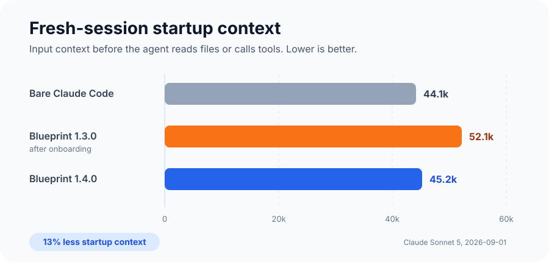
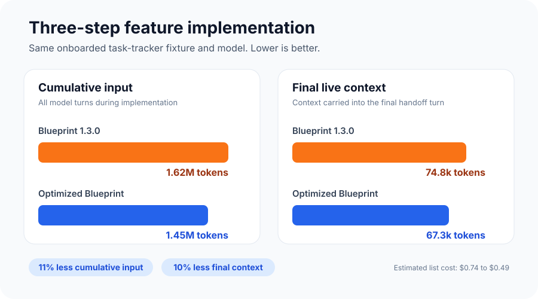

# Context Efficiency Benchmark

AI Blueprint 1.3.0 was tested against AI Blueprint 1.4.0 on 2026-09-01. The
benchmark measures startup context and one small three-step feature
implementation in Claude Code.

## Results

| Measurement | Blueprint 1.3.0 | Blueprint 1.4.0 | Savings |
| --- | ---: | ---: | ---: |
| Fresh-session startup input | 52,135 | 45,198 | 6,937 (13.3%) |
| Implementation cumulative input | 1,624,621 | 1,449,599 | 175,022 (10.8%) |
| Final implementation context | 74,805 | 67,256 | 7,549 (10.1%) |
| CLI estimated list cost | $0.7403 | $0.4871 | $0.2532 (34.2%) |

The bare Claude Code fixture started at 44,148 tokens on the same machine. The
Blueprint 1.4.0 fixture was 1,050 tokens above that baseline.

## What changed

| Change | Blueprint 1.3.0 | Blueprint 1.4.0 |
| --- | --- | --- |
| Claude auto-imports | AGENTS, overview, coding standards, interaction rules, active spec | AGENTS, overview, active spec |
| Skill descriptions | 1,920 words | 847 words with routing terms preserved |
| Implementation review | Approval after every step | One feature-level review packet |
| Step checkpoints | Enabled | Disabled |
| Context diagnosis | Manual investigation | `/doctor` reports import and description size, then points to `/context all` |

`coding-standards.md` and `ai-interaction.md` remain in every project. Project
instructions and workflow skills read them when the task needs them instead of
carrying both files through every turn.

Per-step review and checkpoint commits remain available through
`blueprint/config.json`. They are useful for teaching, close pairing, and
high-risk changes, but feature-level review is the lower-context default for new
projects. Setting only `stepReview` to `every` restores per-step approval pauses.
Matching the previous workflow, including optional checkpoint prompts after an
approved step, requires `stepReview: "every"` and
`checkpointCommits: "enabled"` together.

## Method

- Claude Code 2.1.252
- `claude-sonnet-5`, medium effort, 1,000,000-token context window
- Chrome disabled and an empty strict MCP configuration
- Same machine, global Claude configuration, minimal Node task-tracker app, demo
  plans, and Claude-only adapter
- `/onboard`, `/overview`, `/feature 1`, and `/implement`
- No dev server or browser check
- Fresh sessions for onboarding, overview, and feature planning
- Blueprint 1.3.0 resumed the same implementation session after each of three
  step reviews; the 1.4.0 run used one feature-level review handoff

Input totals are the CLI's reported `input_tokens`,
`cache_creation_input_tokens`, and `cache_read_input_tokens`. Estimated cost is
the CLI's list-cost estimate, not a prediction of Claude subscription quota use.

## Limits

This is one controlled fixture, not a universal savings guarantee. Tool output,
project size, global skills, plugins, model behavior, and the work itself can
change both context growth and cost. The test isolates a realistic Blueprint
feature loop, but the generated specs and implementations were not byte-for-byte
identical.
